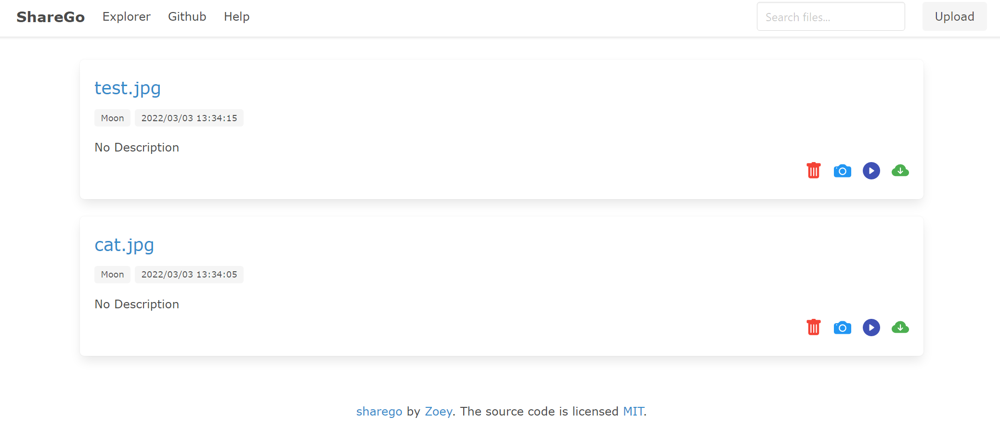
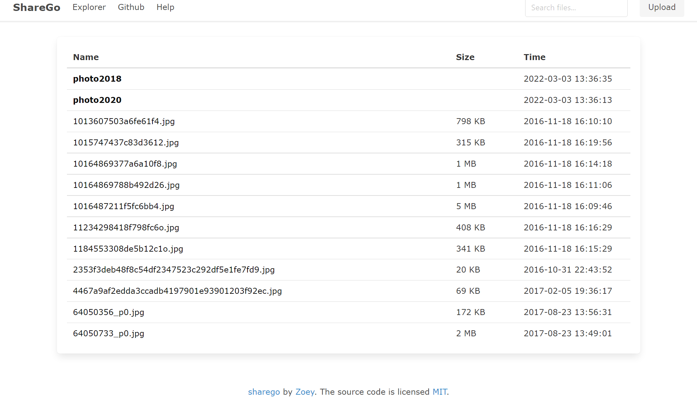

# sharego
​	这是一个文件共享工具，可在线查看并通过二维码分享文件。并且可以指定文件夹进行共享，文件夹可包含子文件夹。

## 	使用方法

1. 因为引用了sqlite3库，编译之前需要把CGO编译选项打开，否则可能编译失败。编译程序：

   ```
   go build
   ```

   运行程序：

   ```
   ./sharego
   ```

   运行程序后根目录会生成sqlite3数据库文件。

   参数设置：

   ``` 
   -host 指定主机ip地址，可供多个主机使用
   -port 设置端口号，默认为8080
   -Token 删除文件时的检验口令
   -path 指定需要共享文件夹的路径
   ```

   该工具有两种模式，默认情况下上传后的文件会存储到自动创建的`./upload`文件夹内，并且文件浏览器会显示`./upload`内的文件；如果指定了`path`参数，则文件浏览器显示设置的共享文件夹内的所有子文件夹和文件。

   

   ## 演示

   

   

